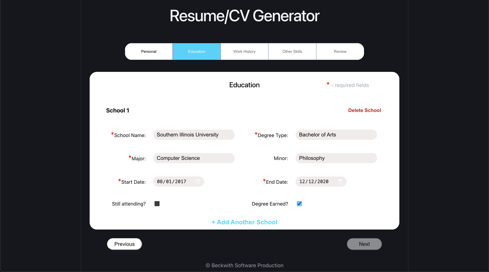
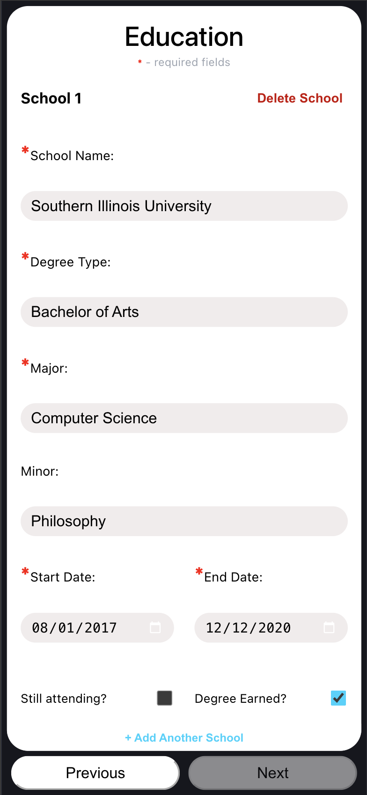
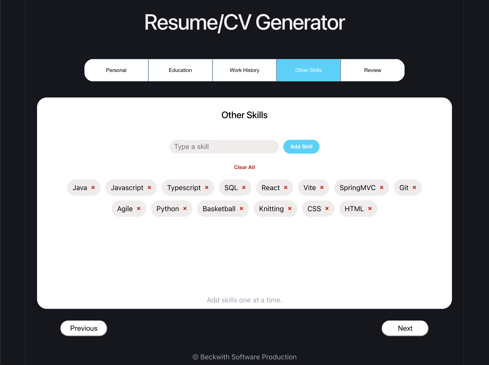
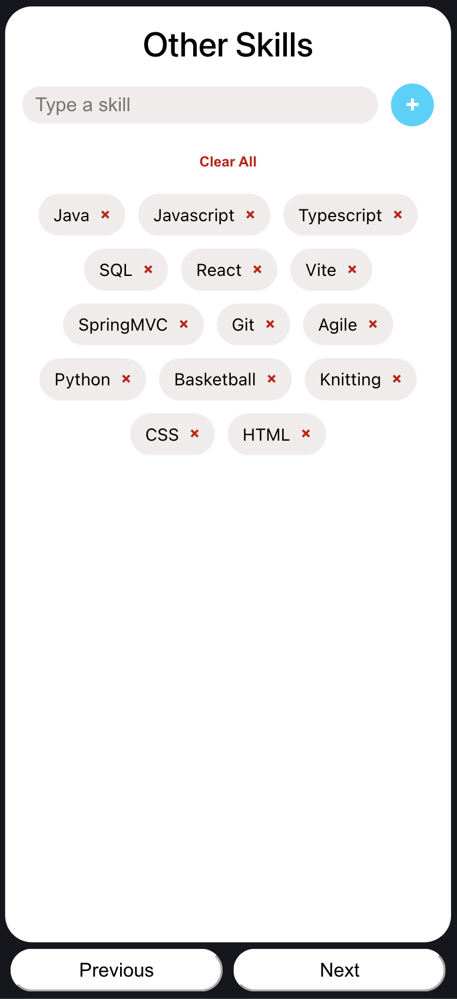
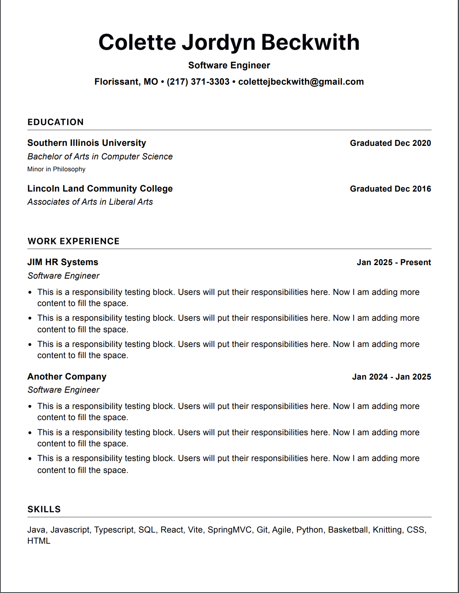

# Resume/CV Generator

[Live Demo](https://resume-cv-generator-lake.vercel.app/)

A responsive multi-step resume builder built with React and Vite that allows users to enter personal, education, work history, and skills information, review the completed data, and generate a print-friendly resume.

## Screenshots

<p align="center">
    
    
    
    
    
</p>

## Overview

This project was built to practice building a more realistic frontend application with multi-step form logic, validation, conditional rendering, responsive design, and document generation.

Instead of being a simple static form, this app guides the user through the resume-building process step by step, validates required fields before allowing progression, supports multiple education and work history entries, and formats the final data into a polished resume layout.

## Features

- Multi-step resume creation flow
- Progress bar navigation with step locking/unlocking logic
- Validation for required fields before advancing
- Email and phone number validation
- Conditional date logic for:
  - still attending
  - degree earned
  - still employed
- Dynamic add/remove support for:
  - multiple schools
  - multiple employers
- Responsive mobile layout
- Review page for checking entered information before generation
- Printable resume document layout
- Resume content sorted by date for education and work history

## Tech Stack

- React
- Vite
- JavaScript
- CSS
- HTML
- react-to-print

## What I Focused On

This project was especially focused on:

- Building a non-trivial form flow with multiple dependent sections
- Managing nested state in React
- Implementing real validation and navigation restrictions
- Creating a mobile-friendly user experience
- Turning collected form data into a formatted resume document

## Project Structure

```text
src/
  components/
    form-sections/
      Education.jsx
      Personal.jsx
      Submit.jsx
      WorkHistory.jsx
      OtherSkills.jsx
    ContentBlock.jsx
    NavButtons.jsx
    ProgressBar.jsx
    ResumeDocument.jsx
  styles/
    App.css
    NavButtons.css
    ProgressBar.css
    sections.css
    ResumeDocument.css
  App.jsx
  main.jsx
```

## How It Works

1. The user enters their personal information.
2. The user adds one or more education entries.
3. The user adds one or more work history entries.
4. The user adds other skills.
5. The app displays a review page showing the collected data.
6. The app generates a print-friendly resume layout from the user’s input.

## Validation Logic

The app includes step-based validation to prevent users from advancing with missing required information.

Examples include:

- Personal step requires:
  - name
  - phone
  - email
- Education step requires:
  - school
  - degree
  - major
  - start date
  - end date unless "still attending" is checked
- Work history step requires:
  - company
  - position
  - start date
  - responsibility 1
  - end date unless "still employed" is checked

The app also validates:

- future start dates
- end dates that occur before start dates
- email formatting
- phone formatting

## Resume Output

The app transforms the entered form data into a cleaner resume layout that includes:

- Header with name, title, and contact information
- Education section with school, degree, major, minor, and date information
- Work experience section with employer, role, dates, and bullet-point responsibilities
- Skills section

## Responsive Design

The application was designed to work on both desktop and mobile layouts.

Special attention was given to:

- stacked mobile form layout
- mobile-friendly date and checkbox placement
- review-page readability on smaller screens
- preserving usability while managing large form sections

## Challenges I Worked Through

Some of the more interesting challenges in this project included:

- keeping multi-step navigation locked correctly when required data is removed
- handling conditional date fields cleanly
- managing dynamic lists of education and work entries
- making the review page responsive
- formatting a printable resume document from nested form state
- dealing with browser quirks around native date inputs

## Future Improvements

Planned improvements include:

- direct PDF download instead of relying on print flow
- multiple resume templates
- editable formatting/theme options
- local storage or database persistence
- optional bullet-point suggestions or content enhancement features

## Getting Started

Clone the repository:

```bash
git clone https://github.com/colettejbeckwith/Resume-cv-generator.git
```

Move into the project directory:

```bash
cd Resume-cv-generator
```

Install dependencies:

```bash
npm install
```

Start the development server:

```bash
npm run dev
```

## Build for Production

```bash
npm run build
```

## Why I Built This

I wanted a project that was more representative of real frontend work than a simple toy app. This project gave me experience with:

- component composition
- nested state updates
- UI validation
- conditional rendering
- responsive CSS
- transforming user input into a polished final product

## Author

Colette Beckwith

GitHub: [colettejbeckwith](https://github.com/colettejbeckwith)